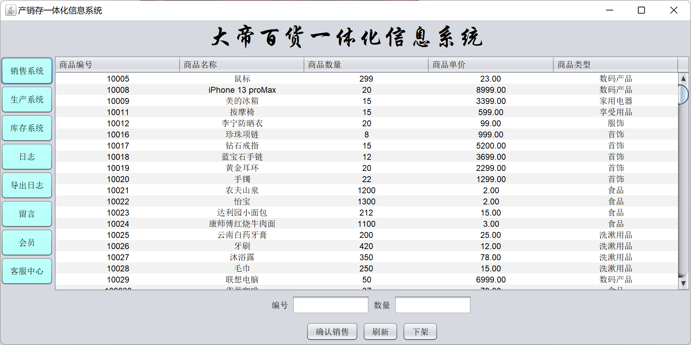
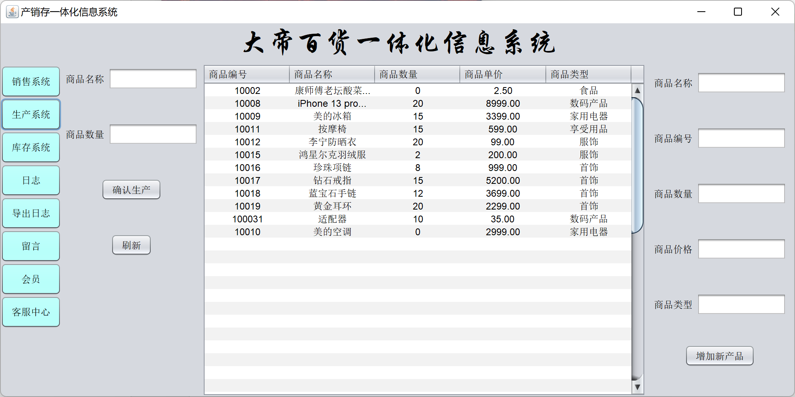
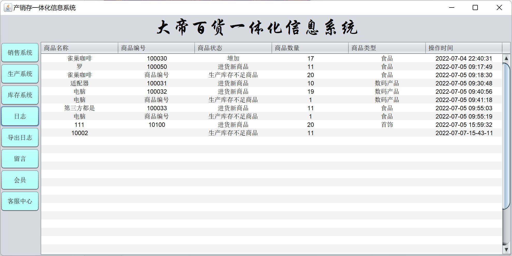
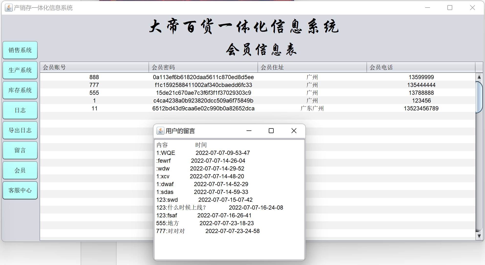
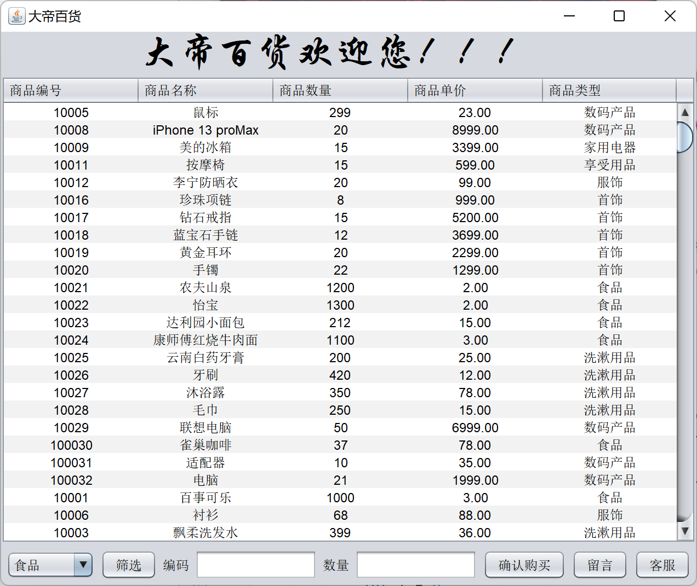
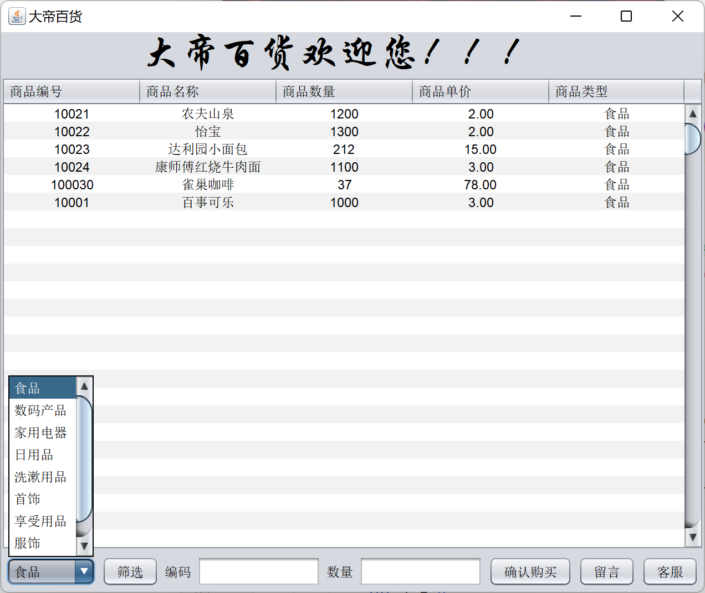
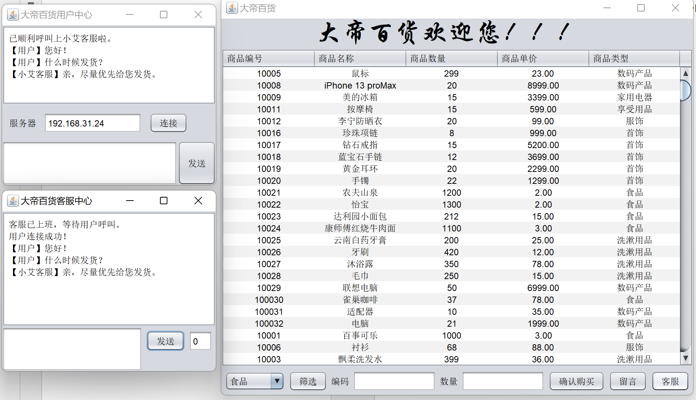

# ProduceSalesStockSystem

**产销存一体化系统(PSSS)（ProductionSalesStockSystem）**

### **具体实现为百货商场**

**功能：**

 I：用户的注册、登录功能（需要对密码进行处理）

 II：对三种订单进行增、删、改、查操作

​		①采购订单：添加需要采购的货物的信息、修改需要采购货物的信息、删除采购货物的信息、查看需要采购货物的信息。

​		②销售订单：对交易成功订单的查看、对交易成功订单删除。

​		③调拨订单：将货物从一个仓库换到另一个仓库时，对数据进行修改。

III：库存告警功能：

​		商品在库存里有一个下限值，对剩余库存统计分析，低于下限值得商品就要提醒：需要订货了。产生需要进货的订单报表（对低于库存下限的商品，需要放到进货单里面）。

IV：备份功能：

​		对一些重要的数据需要进行备份：如进货订单数据，仓库数据，销售订单数据；还有一些人员数据等等需要进行备份，以防意外情况发生。

---

### 运行结果

#### 登录注册

#### 管理员界面

#### 用户界面

